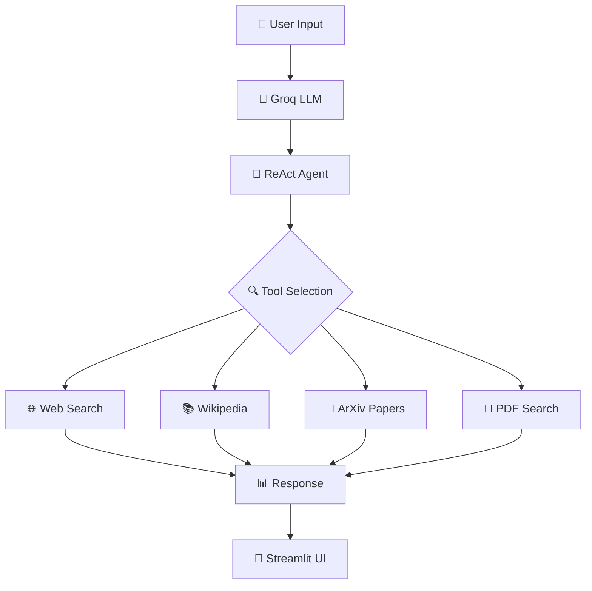

<<<<<<< HEAD
SEARCH-ENGINE-LLM
=======
# 🔍 AI-Powered Search Engine

<div align="center">


**An intelligent chatbot that can search the web, query academic papers, and chat with your PDF documents!**

[](https://your-demo-link.com)
[](LICENSE)

</div>

---

## 🌟 Features

### 🔎 **Multi-Source Search**
- 🌐 **Web Search** - Powered by DuckDuckGo for real-time web information
- 📚 **Wikipedia** - Access to Wikipedia articles for comprehensive knowledge
- 📄 **ArXiv** - Search through academic papers and research documents
- 📖 **PDF Chat** - Upload and chat with your PDF documents using RAG

### 🤖 **AI-Powered Intelligence**
- 🧠 **Groq LLM** - Lightning-fast responses using Llama3-70B model
- 🔄 **ReAct Agent** - Intelligent reasoning and action planning
- 💬 **Streamlit UI** - Beautiful, interactive web interface
- 🔍 **Vector Search** - FAISS-powered semantic search for PDFs

### ⚡ **Advanced Capabilities**
- 📊 **Real-time Streaming** - See AI responses as they're generated
- 🎯 **Context-Aware** - Maintains conversation context across interactions
- 🔧 **Easy Setup** - Simple configuration with environment variables
- 📱 **Responsive Design** - Works on desktop and mobile devices

---

## 🚀 Quick Start

### 📋 Prerequisites

- Python 3.8 or higher
- Groq API key (free at [console.groq.com](https://console.groq.com))

### 🛠️ Installation

1. **Clone the repository**
   ```bash
   git clone https://github.com/yourusername/search-engine.git
   cd search-engine
   ```

2. **Install dependencies**
   ```bash
   pip install -r requirements.txt
   ```

3. **Set up environment variables**
   ```bash
   # Create a .env file
   echo "GROQ_API_KEY=your_groq_api_key_here" > .env
   ```

4. **Run the application**
   ```bash
   streamlit run app.py
   ```

5. **Open your browser**
   ```
   🌐 Navigate to: http://localhost:8501
   ```

---

## 📖 How to Use

### 🎯 **Basic Search**
1. Enter your Groq API key in the sidebar
2. Type your question in the chat input
3. Watch as the AI searches multiple sources and provides comprehensive answers

### 📄 **PDF Chat**
1. Upload a PDF file using the sidebar uploader
2. Wait for processing (creates vector embeddings)
3. Ask questions about your document content
4. Get accurate answers based on your PDF content

### 💡 **Example Queries**
- "What is machine learning?"
- "Find recent papers on quantum computing"
- "Explain the concept of neural networks"
- "What does this PDF say about climate change?"

---

## 🏗️ Architecture



---

## 🛠️ Tech Stack

| Component | Technology | Purpose |
|-----------|------------|---------|
| 🤖 **LLM** | Groq + Llama3-70B | Core AI reasoning |
| 🔗 **Framework** | LangChain | Agent orchestration |
| 🌐 **Web Interface** | Streamlit | User interface |
| 🔍 **Search** | DuckDuckGo, Wikipedia, ArXiv | Information sources |
| 📊 **Vector DB** | FAISS | PDF document search |
| 🧮 **Embeddings** | HuggingFace Transformers | Text vectorization |

---

## 📁 Project Structure

```
📦 search-engine/
├── 📄 app.py                 # Main Streamlit application
├── 📋 requirements.txt       # Python dependencies
├── 📓 tools_agents.ipynb     # Development notebook
├── 📚 LLM.pdf              # Sample PDF document
├── 🔧 .env                  # Environment variables (create this)
└── 📖 README.md            # This file
```

---

## 🔧 Configuration

### Environment Variables
```bash
# Required
GROQ_API_KEY=your_groq_api_key_here

# Optional (for advanced features)
OPENAI_API_KEY=your_openai_key_here
HUGGINGFACE_API_TOKEN=your_hf_token_here
```

### Customization Options
- 🎨 **UI Themes** - Modify Streamlit theme in `app.py`
- 🔍 **Search Sources** - Add/remove tools in the tools array
- 📊 **Model Settings** - Adjust Groq model parameters
- 📄 **PDF Processing** - Modify chunk size and overlap settings

---

## 🤝 Contributing

We welcome contributions! Here's how you can help:

1. 🍴 **Fork** the repository
2. 🌿 **Create** a feature branch (`git checkout -b feature/amazing-feature`)
3. 💾 **Commit** your changes (`git commit -m 'Add amazing feature'`)
4. 📤 **Push** to the branch (`git push origin feature/amazing-feature`)
5. 🔄 **Open** a Pull Request

### 🎯 **Areas for Contribution**
- 🐛 Bug fixes and improvements
- 🆕 New search tools and integrations
- 🎨 UI/UX enhancements
- 📚 Documentation improvements
- 🧪 Test coverage expansion

---

## 📄 License

This project is licensed under the MIT License - see the [LICENSE](LICENSE) file for details.

---

## 🙏 Acknowledgments

- 🏢 **Groq** - For providing fast LLM inference
- 🔗 **LangChain** - For the amazing agent framework
- 🌐 **Streamlit** - For the beautiful web interface
- 📚 **HuggingFace** - For open-source embeddings models

---

## 📞 Support

- 🐛 **Issues**: [GitHub Issues](https://github.com/yourusername/search-engine/issues)
- 💬 **Discussions**: [GitHub Discussions](https://github.com/yourusername/search-engine/discussions)
- 📧 **Email**: your.email@example.com

---

<div align="center">

**⭐ Star this repository if you found it helpful!**

Made with ❤️ by [Your Name](https://github.com/yourusername)

</div>
>>>>>>> 104a2b5 (Changed LLm)
